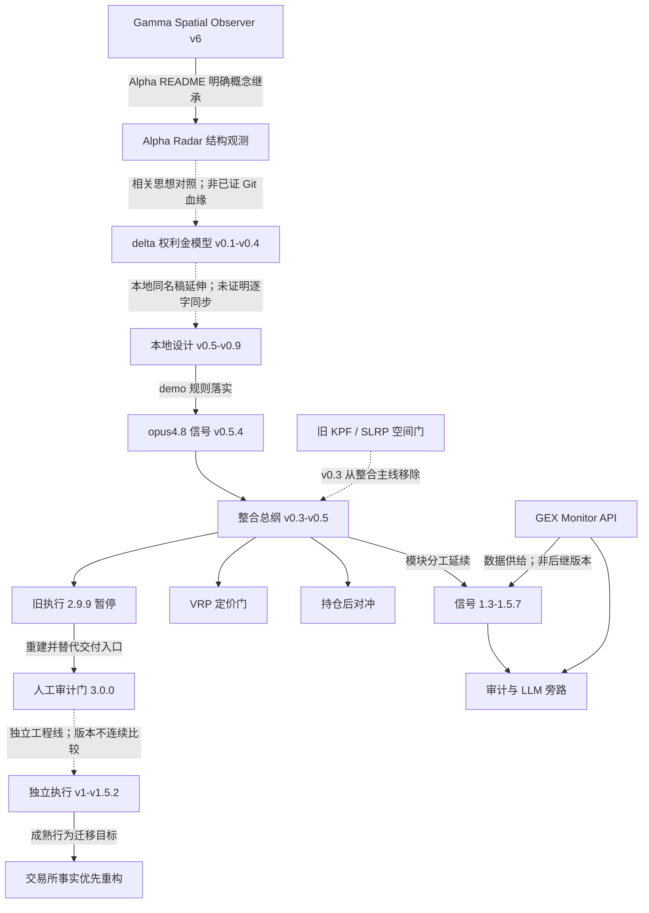

# 理论演进路线

核对日期：2026-09-07。本文按理论问题组织历史；提交日期、tag 与文件指纹见[证据台账](02_版本与证据台账.md)。文中的参数仅复述对应历史规则，不构成新的参数批准。

## 1. 主线与分流

最初的问题是“如何识别结构锚是否有效”，随后扩展为“什么条件下期权卖方获得足够补偿”，再分成信号证据、执行定价、持仓风险和审计解释。工程迭代并不是一直向同一个评分模型叠加因子：多次重要变化实际是在收回职责、移除重复证据或限制模型权限。

图中实线说明原文明确的设计关系，虚线标示相关线索、版本分流或退役关系。尤其不能把 GEX API、前端和执行层排成彼此替代的一串版本。

## 2. 观测前身：Gamma Observer 与 Alpha Radar

**问题**：价格离开 GEX 候选锚时，是局部扰动、暂时缺口，还是定价中心迁移？

[fmz 的 Alpha Radar README](https://github.com/x18055868223-png/fmz/blob/44c043cb83bc9235c3af8369a221142a8663cab2/README.md)明确继承 Gamma Spatial Observer v6 的吸收带与确认机制，但把目标改为脱离过程的结构分类。GEX 提供候选参照，锚效用仍需成交行为验证；输出不是自动交易指令。

可证远端轨迹为 2026-04-07 首次提交，随后 `1.1`、`1.4` 标签；两个 GitHub Release 都发布于 04-18，不能把 Release 日期当作最初研究日期。Gamma Observer v6 在这里是被引用的前身，本次没有取得它独立完整的版本档案。Alpha README 自身仍写“封版 v1.0”，也不能覆盖目录及标签中的 v1.1–v1.4。

**保留**：锚不是价格真值、必须反向验证。**没有证实**：仅凭观测分类即可获得期权卖方优势；Alpha 到 delta 的直接代码继承。

## 3. 权利金模型：从雏形到设计收口

远端 [delta v0.4 README](https://github.com/x18055868223-png/delta/blob/955698708b54671e3681e39f9e95c85c13f33489/README.md)及本地项目“中性回路”的八份 draft、`design_final`、`soul.md` 构成本阶段证据。本地稿正文多数没有独立发布日期，因此按文内承接关系排序。

| 版本 | 为什么改 | 关键变化与保留边界 |
| --- | --- | --- |
| v0.1 | 把 Gamma 对冲、LP 接管与再定价后的均衡从想法变成可检验模型 | 定义中性回路与带保护腿卖方结构；明确处于研究定义阶段，不是稳定套利 |
| v0.2 | 防止指标堆积和资金口径混乱 | 模块化与因子熵减要求；CVD 等归入 TMV；偏向单侧 Credit Spread；保护腿优先；固定风险预算替代固定名义投入 |
| v0.3 | 理论合格的腿可能无法建立，经验 Delta 也容易被误当定律 | 深度前置、残腿作为异常兜底、TMV 面向到期窗口、Skew 补充；纠正美式提前行权论据向 Deribit 欧式合约的直接迁移 |
| v0.4 | Anchor、倾向和开仓可行性缺少足够明确的操作定义 | Anchor 最小实现、TMV-F 两层结构、可执行性硬门、因子审查；不把具体实现参数包装成已验证真值 |
| v0.5 | 阶段性收口，停止扩张能力 | 交易员预设事件/预算/到期边界，模型判断结构、信息、补偿和可执行性；正文承接 v0.4.1，但本次清单未找到独立 v0.4.1 稿 |
| v0.6 | 先检查建仓前熵减链是否完整 | `External Gate → Anchor → TMV-F → Premium/Skew → Combo Risk → Depth → Decision`；持仓管理暂归风控，信息不足可拒绝交易；v0.5.1 为文内引用缺口 |
| v0.7 | 前版对交易磨损、持仓后管理和迭代审计不足 | 补三项；明确小资金、固定风险比例、短到期窗口的高风险卖方定位；原文提出冷启动校准，本次整理不等于新实盘授权 |
| v0.8 | 因子和模块已有覆盖，继续增加只会稀释职责 | 收口解释闭环、Trade/No Trade 记录、拒绝复盘、TMV-F 市场状态与收益归因 |
| v0.9 设计封版 | 汇总 v0.1–v0.8 与 soul 原则，供编码接手 | 固化精准说明书；“封版”明确不是市场长期验证，也不表示参数永远不变 |

本地 `soul.md` 的可复用要求是：每次修改说明它降低哪个不确定性、是否破坏模块边界、事实/输出/拒绝条件是否更清楚。**“熵减”在这些稿中首先是设计原则；没有统计检验时不能把它写成已测得的模型收益或信息增益。**

`neutral_regulation_demo_spec_v0.1.md` 随后把设计稿和 soul 转成“可编码、可记录、可复盘”的最小 demo。这里的 demo v0.1 与策略雏形 v0.1 是不同版本体系。

## 4. opus4.8：证据层进入可运行信号

本地“中性回路 - opus4.8”的 `HANDOFF.md`（文内生成 2026-06-01、后含 06-02 补记）给出 demo `0.5.4` / schema `nrd.schema.v0.5.4`。主模块为 External Gate、Anchor、TMV-F；EDB 担任方向合成权威层，M-DIE、NeutralRepair、SRD、GGR、宏观与信号事件提供分层证据。

原文记载 v0.5.3 曾在趋势场景中暴露置信标定问题，v0.5.4 调整连乘压缩、证据覆盖与权重口径，并修复 4h CVD 就绪阈值。其历史检查记录不能替代本次复跑；更不能用单一案例证明调整后的概率校准可靠。**旧刻度与新刻度的置信分布不可直接混合评估**，这是应继承的研究边界。

该交接文件明确“封版暂缓、待实盘复观”，同时保持只读、不选腿、不下单。`INTEGRATION_HANDOFF.md` 的“信号 → KPF → 执行”是此时的旧整合路线，须与下一阶段的取消决定一起阅读。

## 5. 总纲整合：减法、定价缺口与完整会话

以下总纲均在 [xxproject 完整资产树](https://github.com/x18055868223-png/xxproject/tree/dbb59dbac8349e874277713515232a43ea901dd1/00_%E6%80%BB%E7%BA%B2)可查；本地原文指纹另列台账。

| 文档阶段 | 调整原因 | 设计决定与尚未等同实现之处 |
| --- | --- | --- |
| 整合参考 v0.1（文内 2026-06-02） | PLAN/ORDER 依赖手动改参数和重启，运行割裂 | 比较多种路线，推荐信号独立、执行内聚；统一 ExecutionSession，把 VRP 放在计划内、对冲放在持仓后 |
| 总纲 v0.3 | 原有空间门与信号证据重叠，整合成本过高 | 从整合主链取消 KPF/SLRP，形成信号、执行、对冲三模块；本次有限校对历史结果，未重新回放行情；原文的普遍性论证不能替代样本外验证 |
| 总纲 v0.4（文内 2026-06-02） | 信号可用不回答权利金是否足以补偿风险 | 加 VRP 建仓前独立硬门，以 IV/RV 与摩擦评估补偿；不决定方向、不进入既有评分权重、不绕开其他门 |
| 总纲 v0.5 | 局部门控通过仍不足以说明完整交易链可验收 | 采用 ExecutionSession；补全链扣成本净 P&L 回放、组合硬预算、止盈/末日 Gamma 退出、最小收益归因四项；连续 sizing 和复杂 roll 后置 |

VRP v1.1 的窗口门与候选门区分了预筛和具体结构净补偿。因子总览只称“阶段性封版”，回放和场景模拟证明门行为，不证明卖方 edge 已经跨时点成立。

初期对冲 v0.3 则只产生 `DRY_INTENT_ONLY`，判断持仓风险是否恶化、是否持续、退出与对冲哪个更合适；它不负责入场方向，也不以完全 Delta 中性为目标。旧 `04_对冲模块` 快照仍保留 KPF 项及升 v0.4 待办，不能因为总纲写了取消就宣称每份旧代码已清除。

## 6. 信号与审计：从单次结论到可追溯上下文

| 阶段 | 解决的问题 | 变化与证明边界 |
| --- | --- | --- |
| 信号 1.3.0 / 6 月审计 JSON | 短推和页面不足以追溯因子截面 | producer 留档、manifest/单卡阅读、GEX/rank 展示；审计数据不是交易授权 |
| 时区/前提耐久度，信号 1.4.x | 相同信号在不同时段的前提稳定性可能不同；历史卡回填掩盖源端缺失 | 时段上下文与 producer 原生字段；三年 K 线代理结论只支持市场先验，不是信号胜率、期权 EV，也不乘入 confidence |
| 轨迹审计 / MACRO 双轴，信号 1.5.1 | 单卡看不到变化，方向背景又易与冲击否决混用 | 状态转移及账本；MACRO 背景与 shock 门分开，旧分数层阻断不等于现行 hard veto |
| 价格锚耐用性 1.5.2 | 静态方向不能描述前提破坏风险 | 增加 AUDIT_ONLY 耐久信息；时间上下文与价格锚评分不互相冒充，保持方向/置信/许可边界 |
| NeutralRepair 1.5.3 / 1.5.5 | 触发门与状态保存造成漏信号或过早确认 | 真实 Anchor 下穿交接、两次新鲜修复观测、活动位移阻断；后续修 TTL、数据间断、反向 episode 携带与去重，不能伪造修复 |
| 语义及运行输入 1.5.4 / 1.5.6 | Funding/GEX 量纲或旧输入可能伪装成当前有效证据 | 区分温和 Funding 与极端警告、名义 GEX 与 proxy；失效输入、积压成交、旧价格、last-good 数据分别处理；留档有序重试 |
| 信号 1.5.7 | 统一 Funding/CVD/GEX 机械语义，满足固定轮次观察需求 | 北京时间 23:00 固定分析卡复用只读链；只绕过发卡触发，不伪造 NeutralRepair 确认，也不授予执行许可 |

实现证据：信号 [1.5.7 语义提交](https://github.com/x18055868223-png/xxproject/commit/aebdf20c5bd749c8fce3a3d14cb0e83c4900b4df)及 [2c72162 的 producer](https://github.com/x18055868223-png/xxproject/blob/2c7216229a0f64c95cc37355e6151bf0cee01189/demo/%E6%9C%80%E6%96%B0%E4%BA%A4%E4%BB%98%E7%89%A9/neutral_regulation_demo_fmz.py)。逐 tag 的真实策略版本见台账，不按 r3.x 数字推断。

## 7. LLM 与数据旁路：增加解释，不增加交易许可

本地“信号后 LLM 独立理论视角”方法论把 LLM 与系统结论的分歧用作去偏对照；同输入意味着误差可能相关，不能直接把一致当成独立概率证据。原文中“增信”等讨论须与现行代码边界区分：旁路不会重写 producer confidence 或执行权限。

6 月 Gemini 盲审/对照审计之后，状态转移表达审查在 v1.2.4 收束为格式与展示口径；7 月 [综合辅助审计层](https://github.com/x18055868223-png/xxproject/commit/80779e2109cc6cff0cfbe3c9676a47d2c573ee85)继续组织结构、证据、资金与宏观解释。硬阻断下的建议必须保守，不允许 LLM 新建许可。

8 月 [DeepSeek 迁移](https://github.com/x18055868223-png/xxproject/commit/64c807cd3d8255e38097c72bd53f1b4c7da45591)及有界恢复解决 API/格式/发布可靠性；它们不等于理论已经校准。后续 [移除仅由时段推导的辅助证据](https://github.com/x18055868223-png/xxproject/commit/03495326f475373b9048dafe690c04ae6fd6d98b)再次强调：可读解释必须有真实来源，不能由上下文猜造事实。

GEX API 是独立数据供给线：6 月提供结构化字段及滚动 rank；8 月在 xxproject [转向公共 JSON 数据源](https://github.com/x18055868223-png/xxproject/commit/0636550ab21b1e5b7cd36801b24a48ba8e8b1c30)。数据源迁移首先要求单位、时间戳、覆盖率与缺失语义等价，不能把抓取成功当成理论前提有效。

## 8. 执行分流：从信号消费到人工审计门，再到交易所事实

旧执行 v2.9.9 已积累信号双包血缘、VRP、确认码、预算、残腿恢复、持仓管理等资产，但本地暂停点明确因大方向调整停止推进。整合仓库随后交付 `3.0.0-manual-gate`：人工参数驱动计划，当前版本不消费信号层输入。**这是一项主动边界调整，不应画成自动信号闭环已经完成。**

独立执行仓库将测试轮 v3.x 与正式验证交付 v1 分开命名，后续 v1.1–v1.5.1 包含恢复、对冲降噪、账本、冻结与可视化等修正。其 [v1.5.1 分类清单](https://github.com/x18055868223-png/Neutral-Loop-Execution-Layer/blob/76e737144fb4e5cf228c8562de944624d1e21f37/artifacts/VERSION_CLASSIFICATION.md)是已推送证据；“Formal Live-Validation”是交付分类，不是实盘验收结果。

本地 v1.5.2 继续处理按 DTE 时间桶选择普通 TP 阈值，以及短腿/对冲已平后的微小保护腿残值收束。它要求撤单终态、持仓重读和账本证据，不能把本地残值推断当作交易所结算；交接稿仅记录本地确定性验证。

“价差执行层重构”在此基础上提出更短的主链：交易所事实 → 规范化 → 本地证据对账 → 领域状态 → 单一下一意图 → 写门 → 重读 → 持久化与中文状态。其宪法同时约束错动作与永久等待：仅当阻断本身符合当前事实契约时，fail-closed 才是正确结果。当前 `0.7.11-g8.3.8` 是另一条本地候选线，不是对旧版本号的数字降级，也不是已统一的上线版本。

## 9. 理论接管后的判断

可以延续的原则包括：锚需观察验证、因子须解释增量信息、方向/定价/执行分权、风险预算先于动作、交易所事实高于本地推断、解释必须可追溯。

主线以当前真实输入和消费路径为准；核心思想与失败尝试进入[知识档案](knowledge/01_核心思路与尝试档案.md)。其中区分限定证伪、工程替代、诊断保留、概率命名偏差和零权重形式保留；不得把这些不同裁定简化为一串“旧版无效、新版正确”。

尚需证据的核心问题仍是：信号在不同版本与市场状态下是否校准、VRP 扣全成本后是否有跨时点补偿、真实成交和对冲成本如何影响净收益、完整生命周期是否持续且可恢复。下一步不默认新增因子或改阈值，先按[后续路线](04_后续路线与接管规则.md)补齐各自的验证链。

2026-09-07用户进一步明确：实际固定使用末日/周末垂直价差，但信号结构寿命未知。研究入口因此收敛为时间适配：先区分输入回看、状态TTL、未来预测窗口与交易风险窗口，不能从24h/48h名称或状态尚存推出持有期证据。该修正记录于[研究记忆](PROJECT_MEMORY.md)，不代表新增已验证的期限模型。

同日继续讨论固定方案或多方案并存。当前建议为一套主方案及不交易选项、最多一个离线替代对照；现有价差作可替换基线，不宣称永久最优。该建议保留研究开放性，不启动网格/突破实现或多策略切换；采用条件见研究记忆第3节。
