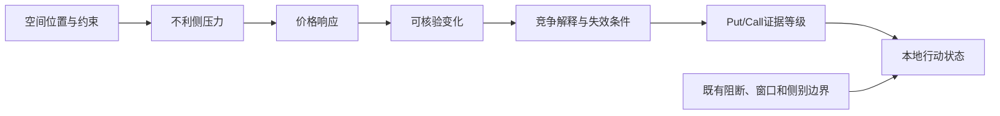

# 当前版本评级与推理链：通俗说明

对应阶段：2026-09-08“中性纸面”本地定稿。本文解释当前版本如何组织证据、产生评级、供交易员阅读。代码决定实现口径，当时市场事实和真实报价决定证据边界；样式定稿没有改动评级算法。

## 一张卡先看什么

当前版本的入口不是“模型说涨跌，所以做多做空”，而是先回答：这张卡显示的市场空间怎样约束价格？哪一侧的信用价差环境更舒服？主要反证是什么？什么变化会推翻判断？

阅读顺序可以分为四步。第一，看最高辅助交易决策：是否可以进入人工准备，Put和Call各是什么等级。顶部量价、主动流的倾向是当前观察；模型自己的价格判断在“LLM独立复核意见”里单列。第二，看空间约束：现价离墙位、翻转点和锚带多远，Gamma体制与净敞口是否共同支持缓冲或放大解释。第三，看压力和响应：哪一侧正受到不利压力，价格有没有随之推进。第四，看关键变化、反证和下一观察：墙位在动还是价格在动，什么变化会增强或推翻判断。

## D到S怎么理解

行动栏说明边界允许时的通常用途；等待、阻断和失效条件仍可覆盖行动提示，不改证据字母。

| 等级 | 通俗含义 | 行动含义 |
| --- | --- | --- |
| D | 当前事实总体反对这一侧适配 | 本轮回避 |
| C | 看得懂，但支持优势不明显 | 普通观察 |
| B | 有值得盯的机会，但反证仍重 | 启动注意力，不新增推送 |
| A | 适配解释更有依据 | 若本地边界允许，可进入人工准备 |
| S | 支持关系很清楚，主要替代解释更难成立 | 与A同属可准备范围，仍需过本地边界 |
| 未评级 | 必要事实、引用或说明无效 | 不用低等级遮住错误 |

“越高”表示模型的整体论证更支持这一侧的环境适配，不是已经验证的赚钱排序。B到S是在比较整条证据链的说服力，不是逐级要求更多理想行情，也不是计算赞成票。当前推理顺序先看空间约束有没有依据、不利压力是否正在推翻它，再解释方向；弱方向也可能有较强的适配证据。

强下跌并不自动让卖Call达到高等级，强上涨也不自动让卖Put达到高等级。波动扩大、墙位失效或价格穿透原结构是需要解释的反证；如果模型依赖的约束已被推翻，该论证就应重审。不能把任何单项变化机械写成全局降级。墙距只说明空间位置，不证明墙能挡住价格；正净Gamma也不等于已测得强约束。

Put和Call必须分开评级。Put侧关注下行侵入压力，Call侧关注上行侵入压力。价格倾向也是独立结论：它告诉你当前标的更偏多、偏空还是分歧，但不能替代两侧价差适配等级。比如价格偏空时，Call侧可能更舒服，也可能因为上方结构太弱、波动反馈不明而只能B或C；价格中性时，如果上下边界、压力响应和变化关系清楚，也可能出现较强的一侧证据。

## 推理链的核心

当前版本先把旧的大对象整理成专用事实包，只保留交易员真正需要的事实：当前价格和结构位置、上下墙位与距离、净Gamma与体制、主动成交和量价路径、资金费率和宏观背景、前后卡可核验变化、数据质量与缺口。旧置信、旧耐用总分、旧长报告和重复rank不进入新评级输入；它们不被拿来平均，也不作为“高于多少就是A”的门槛。

正常每卡由LLM做一次综合评审，同时给出每侧评级、支持解释、主要反证、竞争解释、下一观察、失效条件和独立价格倾向。临时网络或格式错误可以有一次恢复，总共最多两次HTTP尝试；不会因为等级低或答案不满意就重评。

本地程序随后核对事实引用、时间、格式和已知越界表述，并检查A/S有没有引用空间或压力响应事实、有没有相应论述。它不另算一个分数，也不能自动证明整段因果推理正确。字母由模型提出，程序决定这个输出能否作为有效评级展示。整体结果损坏可以导致整卡未评级；可隔离的单侧问题只影响该侧，合法观察继续保留。

行动状态由本地生成。旧有阻断、等待窗口、失效状态和原信号侧别边界仍然有效，但不会把证据字母强行压低。一侧可以是A，同时显示等待确认或本地阻断，不能进入人工准备。旧置信仍可能通过既有信号门控间接影响行动边界，本轮没有删除这些机器消费者；只读环境的执行权限关闭则不代表市场不适配。

只有有效A/S且边界允许，页面才提示人工准备。具体两腿、报价、净补偿、费用、退出和风控仍要另行核对。例如信用Put价差在到期时能保留多少权利金，取决于价格与两腿行权价的位置关系；环境评级不能替代这笔交易的损益条件。[OIC信用Put价差说明](https://www.optionseducation.org/strategies/all-strategies/bull-put-spread-credit-put-spread)支持这一机制边界，不是本模型收益的证据。

## 三个说明性例子

以下都是帮助理解的假设场景，不是真实评级记录，也不是新的条件表。

例一：没有强方向，但结构证据较强。假设当前结构参照有效，已有价格观察表明买方压力没有明显向上推进，反弹或结构迁移等竞争解释也得到合理讨论。即使价格方向中性，Call侧仍可能得到较强评级。单凭“价格在双墙内、净Gamma为正”还不足以得出这个结论。

例二：强单向移动不必然适配。假设真实有效观察显示卖出压力伴随价格下移，原先依赖的下方约束也遭到破坏，这会反对Put侧的适配解释。“反证很强”可以支持有效的低等级，不能因此叫未评级；未评级用于缺少必要证据或判断无效。Call侧仍须单独论证，不能自动接收一个高等级。

例三：A但等待。某侧证据链较强，模型给出A，本地也接受其引用和推理，但旧有事件窗口尚未打开，或原信号侧别边界暂不支持该侧准备。页面应保留A作为证据强度，同时显示等待确认。这不是自相矛盾，而是把“市场证据较强”和“现在能不能准备交易”分开。

## 当前限制

代码事实：事实包构造器按当前截面、空间、压力、价格响应、变化和质量组织；前后变化必须通过身份、时间、品种、版本、哈希和结构校验；评审器一次请求，当前Prompt要求同时返回两侧评级与价格倾向；本地校验会拒绝伪造引用、越界事实、缺少支持引用的高等级，以及只靠方向动量组成的A/S。

模型论证要求：模型可以用定性证据更新比较支持解释和竞争解释，但不能输出未经校准的概率、胜率或后验百分比。S可以来自现有事实之间更清楚的关系，不强制新增来源。同一份期权数据产生的墙、锚、净Gamma，以及同窗口量价和成交派生量，不能仅因名字不同就算多份独立确认；这个要求仍需人工检查模型实际论证。所谓概率校准，需要指定事件并对照真实发生频率，字母本身没有概率含义。[概率校准说明](https://scikit-learn.org/stable/modules/calibration.html)

时效限制：30/60分钟观察窗只是诊断工具，已经维持多久也不代表未来还能维持多久。只有窗口起终点或OHLC汇总时，不能声称期间始终单向或没有中途侵入。历史卡没有单列模型方向，就保留方向缺口；不从旧文字或价差等级反推。

未验证结果：新格式价格倾向Prompt2.0.1尚未做真实API验收；此前两类隔离真实API属于v2早期输入和Prompt2.0.0阶段，不能混成当前格式已实测。当前等级没有证明信号寿命、前向稳定性、期权净收益或FMZ生产状态。后续若要升级为交易依据，必须保存连续同版本真实卡、当时可用事实、人工决策、候选报价和结果，不用少数盈亏反推新规则。
