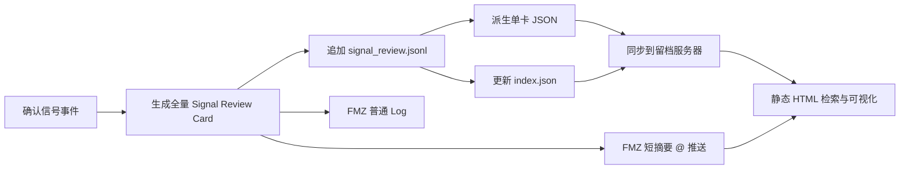

# 信号审计 JSON、FMZ 推送与静态 Web 标准 v1.0

> 日期：2026-06-18  
> 状态：标准基线  
> 范围：信号层审计留档、FMZ 简要推送、静态 Web 审计页面  
> 边界：只记录和展示既有信号结果，不重算因子，不改变方向、置信度、阻断或执行契约

## 1. 目标与结论

本标准建立一条本地优先、可追溯、可远程审计的信号留档链路：

1. 信号确认后，生成一张全量 `Signal Review Card`。
2. 先将完整卡片作为单行 JSON 追加到本地 `signal_review.jsonl`。
3. 从 JSONL 派生每卡 JSON 和轻量 `index.json`，由静态 HTML 页面读取。
4. FMZ 普通 Log 输出卡号和必要摘要，FMZ `@` 推送只发送短摘要与审计链接。
5. 留档或静态站点故障不得阻断信号生成；本地 JSONL 始终是第一落点和唯一事实源。



## 2. 核心原则

- **单一事实源**：`signal_review.jsonl` 保存完整机器结果；页面和推送不得形成独立判断口径。
- **先落盘后分发**：必须先完成本地追加，再异步生成网页材料和发送通知。
- **原始与展示分离**：原始截面放在 `factor_cross_section`；四层中文说明只保存摘要和字段引用，不复制整套原始数据。
- **缺失必须可见**：机器 JSON 使用 `null`，同时在 `quality.missing_fields` 说明缺失原因；禁止用 `0` 冒充缺失值。
- **决策可解释**：必须能回答方向是什么、置信如何算出、冲突在哪里、为什么不能交易、如何解除阻断。
- **可向后兼容**：新增字段优先采用非破坏性扩展；删除或改变字段语义必须升级 schema 主版本。
- **通知不是留档**：FMZ 推送用于提醒，不承载完整证据链。

## 3. 文件与发布结构

推荐目录：

```text
audit_archive/
├─ source/
│  └─ signal_review.jsonl                # 追加写，唯一事实源
├─ cards/
│  └─ 2026/06/18/<card_id>.json          # 单卡物化文件
├─ public/
│  ├─ index.html                         # 静态前端
│  ├─ assets/
│  └─ data/
│     ├─ index.json                      # 检索索引，不含全量截面
│     └─ cards/<card_id>.json            # 页面按需读取
└─ state/
   └─ export_checkpoint.json             # JSONL 派生进度与失败重试状态
```

浏览器不应在每次打开页面时下载并解析完整 JSONL。静态页面先读取 `index.json` 完成列表、筛选和分页，进入详情后再读取对应的单卡 JSON。`index.json` 和单卡 JSON 都是可重建物；丢失时以 JSONL 重新生成。

## 4. JSONL 记录规范

### 4.1 通用约束

- 一个事件一行，一个 `card_id` 只能对应一个确认事件。
- 编码固定 UTF-8，使用 `ensure_ascii=false`，禁止 `NaN`、`Infinity` 和注释。
- 时间同时保留 ISO 8601 与 epoch milliseconds；展示时统一使用 `Asia/Shanghai`。
- 方向分数、投票和标准化值使用 `[-1, 1]`。
- `confidence` 使用 `[0, 100]`；`agreement`、`coverage`、`conflict.ratio` 使用 `[0, 1]`。
- 费率使用小数，例如 `0.00012` 表示 `0.012%`。
- 金额字段必须声明币种或单位，例如 `net_gamma_notional_usd`。
- 英文枚举供程序使用，中文字段只承担展示解释。
- `card_id` 推荐格式：`<UTC8时间>-<symbol>-<episode_id>-<短校验码>`。

### 4.2 顶层分区

| 分区 | 责任 |
|---|---|
| `schema` | schema 名称、版本和记录类型 |
| `identity` | 卡号、episode、标的、策略版本和生成时间 |
| `quality` | 总体数据质量、新鲜度、缺失项和降级项 |
| `market_context` | 事件确认时的价格与运行环境 |
| `decision` | 信号层最终输出，不包含执行层订单信息 |
| `display_layers` | 背景、修正、论证、冲突四层摘要及字段引用 |
| `signal_window` | DIE+Anchor 时序窗口原始结果 |
| `blocking` | 硬阻断、软门及解除条件 |
| `reasoning` | EDB 分数、置信分解和证据账本 |
| `conflict` | 同向、反向证据和冲突比例 |
| `factor_cross_section` | 所有因子的完整原始截面 |
| `delivery` | FMZ 摘要、静态页面和本地留档引用 |
| `integrity` | 内容哈希、脱敏状态和来源追踪 |

### 4.3 全量标准样例

以下为格式化阅读版，数值为合成样例而非真实交易信号；写入 `.jsonl` 时应压缩为单行。

```json
{
  "schema": {
    "name": "signal_review_card",
    "version": "1.0.0",
    "record_type": "confirmed_signal_event_audit"
  },
  "identity": {
    "card_id": "20260618T103852+0800-BTC-3272-3e3b",
    "episode_id": "3272",
    "symbol": "BTC",
    "strategy_name": "中性回路信号层",
    "strategy_version": "1.2.1",
    "producer": "build_signal_review_card",
    "confirmed_at": "2026-06-18T10:38:52+08:00",
    "confirmed_time_ms": 1781750332000
  },
  "quality": {
    "overall": "OK",
    "all_required_sources_ready": true,
    "missing_fields": [],
    "degraded_sources": [],
    "freshness_ms": {
      "tmvf": 126000,
      "macro": 1840000,
      "gex": 540000,
      "skew": 182000
    }
  },
  "market_context": {
    "runtime_mode": "LIVE",
    "price": 63339.96,
    "quote_currency": "USDT",
    "bar_interval": "1h"
  },
  "decision": {
    "lean": "NEUTRAL",
    "lean_cn": "方向中性",
    "support_label": "WAIT_CONFIRMATION",
    "support_cn": "暂不交易，等待确认",
    "side_hint": "NONE",
    "confidence": 38,
    "confidence_calibration": "UNCALIBRATED",
    "trade_allowed": false,
    "next_action": "WAIT_FOR_EVIDENCE",
    "final_conclusion_cn": "方向中性，暂不交易，等待确认；正向证据存在，但宏观压力与结构冲突未消解。"
  },
  "display_layers": {
    "background": {
      "title_cn": "背景层",
      "summary_cn": "DIE+Anchor 修复窗口已确认；量价主干偏多，宏观环境轻度逆风。",
      "source_refs": [
        "market_context",
        "signal_window",
        "factor_cross_section.tmvf",
        "factor_cross_section.macro_pressure"
      ]
    },
    "correction": {
      "title_cn": "修正层",
      "summary_cn": "正 Gamma 钉住状态将置信乘以 0.80；Funding 未触发硬警告；Skew 轻度偏空。",
      "source_refs": [
        "blocking",
        "factor_cross_section.gamma_regime",
        "factor_cross_section.funding",
        "factor_cross_section.skew"
      ]
    },
    "reasoning": {
      "title_cn": "论证层",
      "summary_cn": "TMV 与 CVD 支持偏多，MACRO 与 SRD 反向；EDB 最终 +0.460，置信 38。",
      "source_refs": [
        "reasoning.score",
        "reasoning.confidence_decomposition",
        "reasoning.evidence"
      ]
    },
    "conflict": {
      "title_cn": "冲突层",
      "summary_cn": "冲突比例 38%，等级 MATERIAL；证据未收敛，因此保持 WAIT_CONFIRMATION。",
      "source_refs": [
        "conflict",
        "blocking"
      ]
    }
  },
  "signal_window": {
    "nr_state": "NR_REPAIR_CONFIRMED",
    "is_active": true,
    "episode_direction": "DOWN",
    "peak_m_die": -0.92,
    "event_count_merged": 4,
    "anchor_score": 72.0,
    "anchor_normalized_deviation": -0.31,
    "interpretation_cn": "时序窗口已确认修复，但窗口只确定审计时点，不单独决定交易方向。"
  },
  "blocking": {
    "has_block": true,
    "block_kind": "SOFT_GATE",
    "hard_veto": null,
    "soft_gates": [
      {
        "gate": "WAIT_CONFIRMATION",
        "reason_cn": "证据未收敛或置信未达档，等待确认。"
      }
    ],
    "unblock_conditions_cn": [
      "同向证据继续增强",
      "MACRO 或 SRD 反向压力回落",
      "置信达到策略确认阈值"
    ]
  },
  "reasoning": {
    "engine": "EDB",
    "score": {
      "method": "sum(vote * effective_weight) / sum(effective_weight)",
      "weighted_vote_sum": 0.3862,
      "effective_weight_sum": 0.84,
      "raw": 0.459762,
      "final": 0.459762,
      "lean": "BULLISH_WITH_DISAGREEMENT",
      "smoothing": {
        "applied": false,
        "previous_score": null,
        "parameter": null
      }
    },
    "agreement": 0.619048,
    "coverage": 0.83,
    "confidence": 38,
    "confidence_calibration": "UNCALIBRATED",
    "confidence_decomposition": {
      "formula": "100 * strength * agreement_factor * coverage_factor * ggr_multiplier",
      "strength": 0.613016,
      "agreement_factor": 0.847619,
      "coverage_factor": 0.915,
      "ggr_multiplier": 0.8,
      "confidence_pre_veto": 38.035008,
      "confidence_final": 38,
      "score_full": 0.75,
      "agreement_floor": 0.6,
      "coverage_floor": 0.5,
      "veto_applied": false
    },
    "evidence": [
      {
        "key": "TMV",
        "gloss_cn": "量价主干",
        "vote": 1.0,
        "weight": 0.34,
        "effective_weight": 0.34,
        "information": 1.0,
        "contribution_pct": 88.04,
        "aligned": true,
        "lean": "BULLISH",
        "source_ref": "factor_cross_section.tmvf",
        "detail": {
          "tmv_blend": 0.42,
          "tmvf_24h_final": 0.31,
          "tmvf_48h_final": 0.49,
          "window_conflict": false
        }
      },
      {
        "key": "CVD_4H",
        "gloss_cn": "四小时主动买卖差",
        "vote": 0.55,
        "weight": 0.18,
        "effective_weight": 0.18,
        "information": 1.0,
        "contribution_pct": 25.63,
        "aligned": true,
        "lean": "BULLISH",
        "source_ref": "factor_cross_section.micro_flow.fast_4h",
        "detail": {
          "cvd_sum": 1200.0,
          "verdict": "BUY_CONFIRMS_UP"
        }
      },
      {
        "key": "MACRO",
        "gloss_cn": "宏观压力",
        "vote": -0.25,
        "weight": 0.16,
        "effective_weight": 0.16,
        "information": 1.0,
        "contribution_pct": -10.36,
        "aligned": false,
        "lean": "BEARISH",
        "source_ref": "factor_cross_section.macro_pressure",
        "detail": {
          "macro_score": 0.23,
          "macro_regime": "MILD_HEADWIND"
        }
      },
      {
        "key": "SRD",
        "gloss_cn": "结构风险扩散",
        "vote": -0.08,
        "weight": 0.16,
        "effective_weight": 0.16,
        "information": 1.0,
        "contribution_pct": -3.31,
        "aligned": false,
        "lean": "BEARISH",
        "source_ref": "factor_cross_section.skew",
        "detail": {
          "rr_z": -0.06,
          "data_state": "OK"
        }
      }
    ],
    "participants": ["TMV", "CVD_4H", "MACRO", "SRD"],
    "non_voting_evidence": [
      {
        "key": "FUNDING",
        "vote": 0.0,
        "configured_weight": 0.07,
        "information": 0.0,
        "effective_weight": 0.0,
        "reason": "NEUTRAL_DEAD_ZONE",
        "source_ref": "factor_cross_section.funding"
      },
      {
        "key": "GGR_SPATIAL",
        "vote": 0.0,
        "configured_weight": 0.0,
        "information": 0.0,
        "effective_weight": 0.0,
        "reason": "GATE_ONLY_NO_DIRECTIONAL_VOTE",
        "source_ref": "factor_cross_section.gamma_regime"
      }
    ],
    "summary_cn": "量价与主动买盘偏多，但宏观压力与结构风险构成反向证据。"
  },
  "conflict": {
    "ratio": 0.380952,
    "level": "MATERIAL",
    "aligned_keys": ["TMV", "CVD_4H"],
    "dissent": [
      {
        "key": "MACRO",
        "vote": -0.25,
        "effective_weight": 0.16
      },
      {
        "key": "SRD",
        "vote": -0.08,
        "effective_weight": 0.16
      }
    ],
    "explanation_cn": "多头证据存在，但反向证据占比仍高；当前信号适合观察和复盘，不适合直接交易。"
  },
  "factor_cross_section": {
    "anchor": {
      "anchor_score": 72.0,
      "normalized_deviation": -0.31,
      "data_status": "OK",
      "observed_at": "2026-06-18T10:38:50+08:00"
    },
    "m_die": {
      "value": -0.92,
      "direction": "DOWN",
      "data_status": "OK",
      "observed_at": "2026-06-18T10:38:50+08:00"
    },
    "neutral_repair": {
      "state": "NR_REPAIR_CONFIRMED",
      "is_active": true,
      "episode_direction": "DOWN",
      "peak_m_die": -0.92,
      "event_count_merged": 4
    },
    "tmvf": {
      "direction": "BULLISH",
      "tmv_blend": 0.42,
      "window_conflict": false,
      "tmvf_24h": {
        "final": 0.31,
        "trend_component": 0.28,
        "momentum_component": 0.34,
        "volume_component": 0.22
      },
      "tmvf_48h": {
        "final": 0.49,
        "trend_component": 0.44,
        "momentum_component": 0.53,
        "volume_component": 0.37
      },
      "data_status": "OK",
      "observed_at": "2026-06-18T10:36:46+08:00"
    },
    "micro_flow": {
      "fast_4h": {
        "cvd_sum": 1200.0,
        "verdict": "BUY_CONFIRMS_UP"
      },
      "fast_8h": {
        "cvd_sum": 1840.0,
        "verdict": "BUY_LEAN"
      },
      "data_status": "OK"
    },
    "funding": {
      "last_rate": 0.00012,
      "effect": "MILD_CROWDED",
      "hard_warning": false,
      "data_status": "OK"
    },
    "macro_pressure": {
      "score": 0.23,
      "regime": "MILD_HEADWIND",
      "summary_label_cn": "轻度逆风",
      "data_confidence": 1.0,
      "data_status": "FULL_LIVE",
      "observed_at": "2026-06-18T10:08:12+08:00",
      "components": [
        {
          "key": "VOLQ",
          "source_symbol": "^VIX",
          "source_status": "OK",
          "current_close": 16.2,
          "reference_close": 15.86,
          "change_pct_3d": 0.021,
          "scoring_bps": 210
        },
        {
          "key": "DXY",
          "source_symbol": "DX-Y.NYB",
          "source_status": "OK",
          "current_close": 104.1,
          "reference_close": 103.74,
          "change_pct_3d": 0.0035,
          "scoring_bps": 35
        },
        {
          "key": "US10Y",
          "source_symbol": "^TNX",
          "source_status": "OK",
          "current_close": 4.31,
          "reference_close": 4.3,
          "change_pct_3d": 0.0018,
          "scoring_bps": 8
        }
      ]
    },
    "gamma_regime": {
      "regime": "POSITIVE_GAMMA_PINNING",
      "net_gamma_notional_usd": 12400000.0,
      "flip_point": 62800.0,
      "confidence_multiplier": 0.8,
      "veto": false,
      "pin_strike": 64000.0,
      "distance_to_pin_pct": -0.0103,
      "data_status": "OK"
    },
    "gex_info": {
      "market_state": "POSITIVE_GAMMA",
      "net_gamma_notional_usd": 12400000.0,
      "flip_point": 62800.0,
      "call_wall": 65000.0,
      "put_wall": 60000.0,
      "data_status": "OK",
      "observed_at": "2026-06-18T10:29:52+08:00"
    },
    "skew": {
      "vote": -0.2,
      "rr_z": -0.06,
      "delta_rr": -0.03,
      "rr_blend": -0.05,
      "data_status": "OK",
      "observed_at": "2026-06-18T10:35:50+08:00"
    }
  },
  "delivery": {
    "fmz_push_summary": "【信号】BTC #3e3b 中性/等待确认 强度61 置信38 冲突38% 同TMV+1.00,CVD+0.55 反MACRO-0.25,SRD-0.08 审计:a.example/c/3e3b",
    "fmz_log_ref": "signal_review card_id=20260618T103852+0800-BTC-3272-3e3b",
    "static_web_url": "https://audit.example.com/#/card/20260618T103852+0800-BTC-3272-3e3b",
    "local_jsonl": "audit_archive/source/signal_review.jsonl",
    "local_card_json": "audit_archive/cards/2026/06/18/20260618T103852+0800-BTC-3272-3e3b.json"
  },
  "integrity": {
    "source_snapshot_hash": "sha256:example-source-snapshot-hash",
    "record_hash": "sha256:example-record-hash",
    "contains_secret": false,
    "contains_account_balance": false,
    "contains_position_size": false,
    "redaction_version": "1.0.0"
  }
}
```

## 5. 四层展示标准

四层只负责阅读组织，不另建一套数值：

| 展示层 | 回答的问题 | 主数据来源 |
|---|---|---|
| 背景层 | 信号发生在什么市场和时序环境中？ | `market_context`、`signal_window`、TMVF、Macro |
| 修正层 | 哪些门控或衍生品因素修正了方向/置信？ | `blocking`、Gamma、GEX、Funding、Skew |
| 论证层 | EDB 如何从各项证据得到分数和置信？ | `reasoning.score`、`confidence_decomposition`、`evidence` |
| 冲突层 | 为什么不能行动，或风险主要在哪里？ | `conflict`、`blocking.unblock_conditions_cn` |

前端可以展示中文摘要，但数值组件必须读取 `source_refs` 指向的原始字段。这样修正文案不会造成数值口径漂移。

## 6. FMZ 简要推送标准

### 6.1 定位

FMZ `@` 推送只承担告警和导航作用。完整数据始终位于 JSONL 和静态审计页面。

### 6.2 长度与格式

- 目标长度不超过 140 个 Unicode 字符，硬上限 160 个字符。
- 单事件只发一条，不分段连续推送。
- 使用单行文本；即使邮件客户端拍平换行也不影响阅读。
- 决策信息必须前置，链接必须放在末尾。
- 禁止加入长解释、完整置信公式、宏观组件表或全量因子原始值。

### 6.3 必填顺序

```text
【信号】<symbol> #<short_id> <方向>/<动作>
强度<strength> 置信<confidence> 冲突<ratio>
同<最多2项> 反<最多2项> 审计:<短链接>
```

生产时拼成单行：

```text
【信号】BTC #3e3b 中性/等待确认 强度61 置信38 冲突38% 同TMV+1.00,CVD+0.55 反MACRO-0.25,SRD-0.08 审计:a.example/c/3e3b
```

字段映射：

| 推送字段 | JSON 来源 |
|---|---|
| 标的 | `identity.symbol` |
| 短卡号 | `identity.card_id` 的短校验码 |
| 方向 | `decision.lean_cn` |
| 动作 | `decision.support_cn` |
| 强度 | `reasoning.confidence_decomposition.strength × 100` |
| 置信 | `decision.confidence` |
| 冲突 | `conflict.ratio` |
| 同向/反向 | `reasoning.evidence` 按绝对贡献排序后各取两项 |
| 审计链接 | `delivery.static_web_url` 的短链接 |

若静态链接尚未发布，推送末尾改为 `详见FMZ Log #<short_id>`，不得因此阻断推送或信号落档。

`decision.confidence_calibration` 可继续作为原始 JSON 兼容字段保留，但当前前端关键指标与 FMZ 简要推送不展示“未校准”提示。

## 7. 静态 Web 审计流程

### 7.1 写入顺序

1. 构建并验证完整卡片。
2. 追加写入本地 JSONL，并执行 flush。
3. 按 `card_id` 生成单卡 JSON。
4. 将检索所需字段追加或重建到 `index.json`。
5. 使用临时文件加原子替换发布 `index.json`，避免页面读到半文件。
6. 异步同步 `public/` 到留档服务器。
7. 输出 FMZ 普通 Log，并发送短摘要。

第 3 至第 7 步失败时，第 2 步的本地事实记录仍然有效。失败项进入重试状态，不回滚 JSONL。

### 7.2 `index.json` 最小结构

`index.json` 只保存列表和筛选字段，不复制完整卡片：

```json
{
  "schema_version": "1.0.0",
  "generated_at": "2026-06-18T10:39:00+08:00",
  "cards": [
    {
      "card_id": "20260618T103852+0800-BTC-3272-3e3b",
      "short_id": "3e3b",
      "confirmed_at": "2026-06-18T10:38:52+08:00",
      "symbol": "BTC",
      "price": 63339.96,
      "lean": "NEUTRAL",
      "support_label": "WAIT_CONFIRMATION",
      "confidence": 38,
      "calibration": "UNCALIBRATED",
      "conflict_ratio": 0.38,
      "conflict_level": "MATERIAL",
      "block_kind": "SOFT_GATE",
      "quality": "OK",
      "detail_path": "data/cards/20260618T103852+0800-BTC-3272-3e3b.json"
    }
  ]
}
```

### 7.3 前端功能边界

静态页面第一版应具备：

- 按时间、标的、方向、动作、置信区间、冲突等级、阻断类型筛选。
- 按 `card_id` 精确检索。
- 列表展示时间、价格、方向、置信、冲突和阻断。
- 详情页按四层展示，并提供“原始字段”折叠区。
- 因子贡献使用正负条形图；置信分解、宏观组件和数据新鲜度使用紧凑图表。
- 明确标记 `UNCALIBRATED`、`STALE`、`MISSING` 和 `DEGRADED`。
- 不提供改写信号、改变参数、下单或执行层控制。

第一版不需要数据库、服务端搜索或用户评论系统。数据量增长到浏览器无法流畅载入索引时，再按日期切分索引或升级轻量 API。

## 8. 故障与降级

| 故障 | 必须行为 |
|---|---|
| JSONL 写入失败 | FMZ Log 报错；不得声称已完成留档 |
| 单卡 JSON 生成失败 | 保留 JSONL，记录重试任务 |
| `index.json` 更新失败 | 旧索引继续服务，单卡文件等待补索引 |
| 留档服务器不可达 | 本地继续累计，恢复后按 checkpoint 补传 |
| 静态链接不可用 | FMZ 推送改用 Log/card_id 引用 |
| FMZ 推送失败 | 不影响 JSONL 和 Web 留档；普通 Log 记录失败 |
| 某因子缺失或过期 | 字段写 `null`，质量状态写明，不允许静默省略 |

## 9. 安全与访问

- 静态站点必须使用 HTTPS。
- 页面不得公开暴露密钥、账户余额、真实持仓规模或下单参数。
- 推荐通过 VPN、反向代理鉴权、IP 白名单或一次性访问令牌控制访问。
- `integrity` 必须标明脱敏状态；发布前应有字段白名单，而不是依靠黑名单删字段。
- `record_hash` 用于发现文件被修改，不承担身份认证作用。

## 10. 验收标准

1. 每个确认信号只生成一个稳定 `card_id`，重试不会重复落卡。
2. JSONL 每行均可被标准 JSON 解析器读取。
3. 任一前端数值都能追溯到单卡 JSON 的唯一字段路径。
4. 四层摘要与原始字段不存在方向或数值矛盾。
5. 缺失、过期和降级数据均显式可见。
6. FMZ 摘要包含方向、动作、强度、置信、校准状态、冲突、主要同向/反向证据和审计入口。
7. 断开留档服务器后，信号仍能正常生成并写入本地 JSONL；恢复后可以补传。
8. 删除 `public/data` 后，可以仅凭 JSONL 完整重建静态站点数据。
9. 静态页面不包含任何交易执行入口。

## 11. 实施优先级

- **P0**：按标准生成全量卡片并追加写入 JSONL；FMZ 使用短摘要。
- **P0.5**：生成单卡 JSON、`index.json` 和只读静态 HTML；部署到留档服务器。
- **P1**：增加断点补传、原子发布、鉴权、数据质量看板和历史统计。
- **P2**：数据规模确有需要时再引入轻量 API 或数据库，不改变 JSONL 事实源契约。
